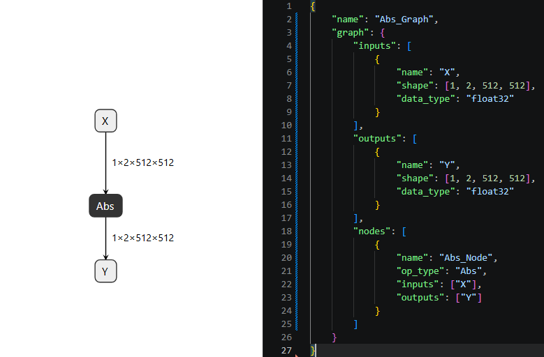

# ONMAConvertOnnx.py

## Purpose

Purpose: This tool converts ONNX models into human-readable JSON format, allowing you to easily inspect,
edit, and analyze model architecture and weights.

## Usage

```text
python Tools/ONMAConvertOnnx.py --input Sample/Abs.onnx --output Sample/Abs.json
```

## Command-line arguments

| Option | Description | Default |
| --- | --- | --- |
| --input, -in | ONNX file | `None` |
| --output, -out | JSON file | `None` |
| --store_npy, -sn | Stores initializers to npy files | `False` |

## Images



## References

- [`Sample/Abs.json`](../../Sample/Abs.json)
- [`Sample/Abs.onnx`](../../Sample/Abs.onnx)
