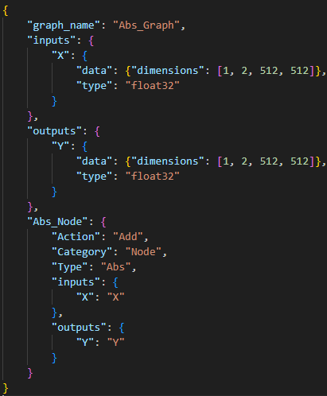
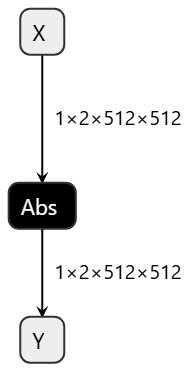

# ONNXManipulation

## Introduction
This is the small tool to create/modify onnx file using json to describe expectation. Users do not need to have onnx programming skill to modify onnx.

## Environment
In order to use this tool, user need to set up below software:
python3.10
numpy==1.26.4
onnx==1.16.1
onnxruntime==1.20.1

## Example
| Abs.json  | Abs.onnx |
|-------|-----|
|||

### Command: 
python main.py --create_graph Sample/Abs.json --output_onnx Abs.onnx
