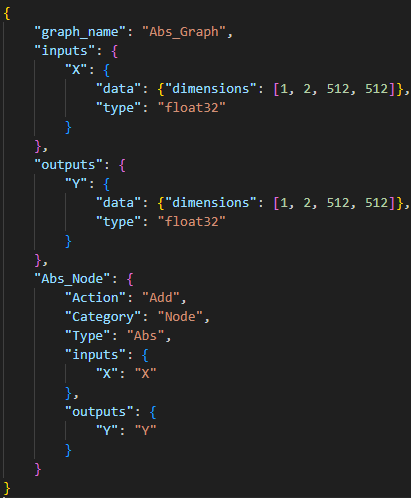
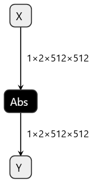

# ONNXManipulation

## Introduction
This project provides a practical set of tools for working with ONNX files. You can create models, 
inspect and modify their structure, update inputs or outputs, and convert models between supported 
formats—all without needing prior ONNX programming experience.

The tools are designed to make model editing feel familiar: describe or adjust model components using 
straightforward text-based workflows, and work with tensor data through NumPy. This makes it easier to 
experiment with ONNX models, automate routine changes, and integrate model editing into existing 
Python workflows.

## Environment
In order to use this tool, user need to set up below software:
- python3.10
- numpy==1.26.4
- onnx==1.16.1
- onnxruntime==1.20.1

## Describes ONNX IN JSON Format
Using the ONNX library to convert an ONNX model file into a human-readable JSON representation
and explain the resulting structure.

[Sample Conv](Docs/Sample/Conv.md)

| Abs.json  | Abs.onnx |
|-------|-----|
|||

### Command: 
python main.py --create_graph Sample/Abs.json --output_onnx Abs.onnx
