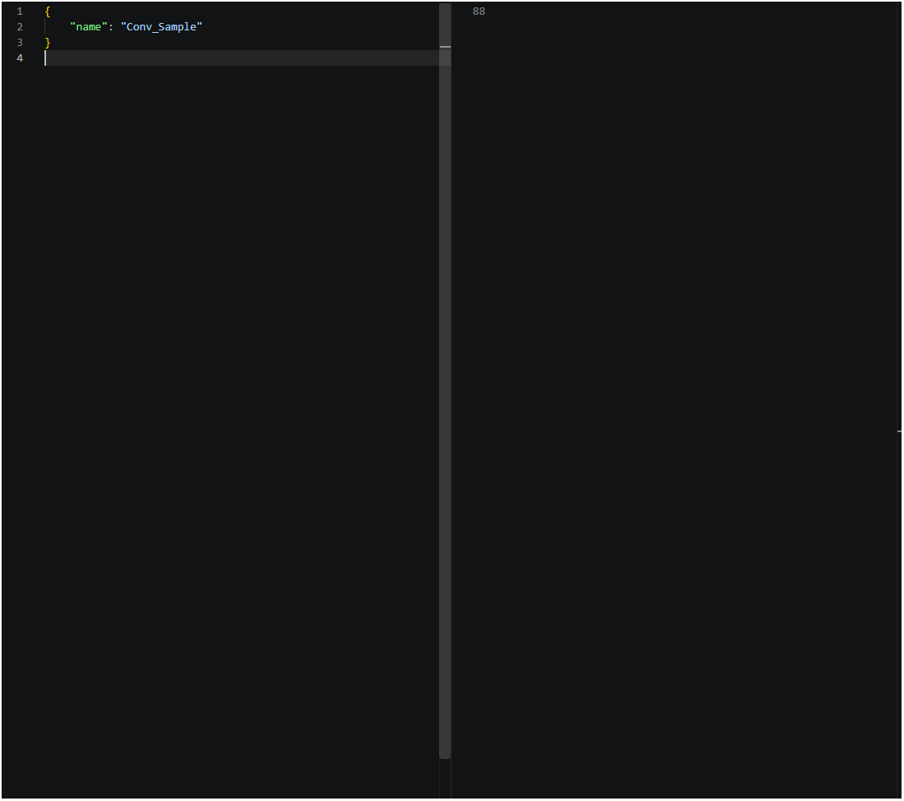

# ONNXManipulation

## Introduction
This project provides a practical set of tools for working with ONNX files. You can create models, 
inspect and modify their structure, update inputs or outputs, and convert models between supported 
formats—all without needing prior ONNX programming experience.

The tools are designed to make model editing feel familiar: describe or adjust model components using 
straightforward text-based workflows, and work with tensor data through NumPy. This makes it easier to 
experiment with ONNX models, automate routine changes, and integrate model editing into existing 
Python workflows.

## Environment
In order to use this tool, user need to set up below software:
- python3.10
- numpy==1.26.4
- onnx==1.16.1
- onnxruntime==1.20.1

## Describes ONNX IN JSON Format
Using the ONNX library to convert an ONNX model file into a human-readable JSON representation
and explain the resulting structure.

A JSON schema where general model information serves:

| Item | Description |
|------|-------------|
| name | Describe network name |
| graph | Outlines the graph structure encompassing inputs, outputs, initializers, and nodes. |
| inputs | Maintains standard machine learning and ONNX schema terminology (name, shape, data_type, data). |
| outputs | Maintains standard machine learning and ONNX schema terminology (name, shape, data_type, data). |
| initializers | Specifies all network constants along with their name, shape, data type, and data. |
| nodes | Specifies all nodes in the network along with key details such as name, op_type, inputs, outputs, and attributes. |

Detail example: [Sample Conv](Docs/Sample/Conv.md)

## Built-in Tools
Provide a comprehensive guide to the most useful built-in standard library modules and utility functions in Python, complete with code examples.

| Tools  | Description |
|-------|-----|
|[ONMACreateGraph.py](Docs/Sample/ONMACreateGraph.md)|This tool is designed to convert a model represented in the ONMA JSON format into an ONNX file. Usage: python Tools/ONMACreateGraph.py --input Sample/Conv.json --output Sample/Conv.onnx|
|[ONMAConvertOnnx.py](Docs/Sample/ONMAConvertOnnx.md)|This tool converts ONNX models into human-readable JSON format. Usage: python Tools/ONMAConvertOnnx.py --input Sample/Abs.onnx --output Sample/Abs.json|

